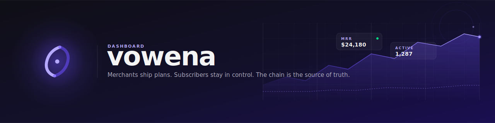

<div align="center">
  <a href="https://dashboard.vowena.xyz">
    <picture>
      <source media="(prefers-color-scheme: dark)" srcset=".github/banner.svg">
      <source media="(prefers-color-scheme: light)" srcset=".github/banner.svg">
      
    </picture>
  </a>

  <p>
    <strong>The merchant and subscriber dashboard for Vowena.</strong><br/>
    On-chain recurring USDC payments on Stellar. No database. The contract is the source of truth.
  </p>

  <p>
    <a href="LICENSE"></a>
    <a href="https://github.com/vowena/dashboard/actions/workflows/ci.yml"></a>
    <a href="https://nextjs.org"></a>
    <a href="https://dashboard.vowena.xyz"></a>
    <a href="https://stellar.org"></a>
  </p>

  <p>
    <a href="https://dashboard.vowena.xyz">Live app</a>
    &nbsp;&middot;&nbsp;
    <a href="https://vowena.xyz">vowena.xyz</a>
    &nbsp;&middot;&nbsp;
    <a href="https://docs.vowena.xyz">Docs</a>
    &nbsp;&middot;&nbsp;
    <a href="https://github.com/vowena/protocol">Protocol</a>
    &nbsp;&middot;&nbsp;
    <a href="https://github.com/vowena/sdk">SDK</a>
  </p>
</div>

<br/>

## What is this?

Two distinct experiences in a single Next.js app, plus a public checkout for sharing plans anywhere.

<table>
  <tr>
    <td width="33%" valign="top">
      <h3>For subscribers</h3>
      <p><code>/subscriptions</code></p>
      <p>Connect any Stellar wallet and see every Vowena subscription tied to that account, across every merchant. Live billing history, next charge date, one-click cancel. No login, no email, no account.</p>
    </td>
    <td width="33%" valign="top">
      <h3>For merchants</h3>
      <p><code>/projects</code></p>
      <p>Create projects and plans, watch subscribers come in, see live MRR, total revenue, active count, churn, and a real-time charge feed. Run the managed keeper or hand it off to your own infrastructure.</p>
    </td>
    <td width="33%" valign="top">
      <h3>Public checkout</h3>
      <p><code>/p/{planId}</code></p>
      <p>Every plan has a clean, shareable, subscriber-facing checkout page. Drop the link in a Tweet, an email, a Notion page. Anyone with a Stellar wallet can subscribe in two clicks.</p>
    </td>
  </tr>
</table>

## Live URLs

| URL | Purpose |
| --- | --- |
| [`dashboard.vowena.xyz`](https://dashboard.vowena.xyz) | This app. Merchant + subscriber dashboard. |
| [`vowena.xyz`](https://vowena.xyz) | Marketing site. |
| [`docs.vowena.xyz`](https://docs.vowena.xyz) | Protocol and SDK documentation. |

## Architecture

```
                                        on-chain reads + signed writes
                                        ┌──────────────────────────────┐
  Wallet (Freighter / Lobstr / xBull)   │                              │
            │                           │   Soroban contract           │
            ▼                           │   CCNDNEGY...EL72T            │
  Next.js 16 App Router  ───── @vowena/sdk ─────►   (testnet)          │
   (Turbopack, RSC, Edge)                │   source of truth            │
            │                            │                              │
            ▼                            └──────────────────────────────┘
  TanStack Query cache                                    ▲
            │                                             │
            │                       Vercel cron (* * * * *)
            └────────────────────►  /api/cron  ───────────┘
                                   serial charge() per sub
```

- **No database.** All state (plans, subscribers, charges, cancellations) lives on the Soroban contract. The dashboard reads from chain and signs writes through the user's wallet. There is nothing to migrate, nothing to back up, nothing to leak.
- **Next.js 16 App Router with Turbopack.** Server Components for the static shell, client components for wallet flows. Note: this is the new App Router with breaking changes; see `node_modules/next/dist/docs/` if you are touching internals.
- **Stellar Wallets Kit** powers the multi-wallet picker. Freighter, Lobstr, and xBull are wired today.
- **TanStack Query** holds every chain read with sensible stale times so the UI feels instant but stays accurate.
- **Vercel cron keeper.** A single cron route at `/api/cron` runs every minute. It discovers due subscriptions in parallel, then submits `charge()` serially against a fresh sequence number each iteration. The contract decides what is actually due, so misfires are no-ops.

## Stack

| Concern | Choice |
| --- | --- |
| Framework | Next.js 16 (App Router, Turbopack) on React 19 |
| Wallets | `@creit.tech/stellar-wallets-kit` (Freighter, Lobstr, xBull) |
| Data fetching | `@tanstack/react-query` over `@vowena/sdk` and `@stellar/stellar-sdk` |
| Styling | Tailwind CSS v4 with brand tokens, DM Sans + Space Mono |
| Deployment | Vercel (cron schedule in `vercel.json`) |
| Network | Stellar Testnet, contract `CCNDNEGYFYKTVBM7T2BEF5YVSKKICE44JOVHT7SAN5YTKHHBFIIEL72T` |

## Features

**Subscribers**

- Wallet-native sign-in. No email, no password, no account.
- Cross-merchant view of every active and past subscription tied to the connected account.
- Live billing history with on-chain transaction hashes.
- One-click cancellation.

**Merchants**

- Project and plan creation with on-chain provenance.
- Subscriber list per plan with live status.
- Real-time analytics: MRR, total revenue, active count, churn, charge feed.
- Managed keeper or BYO. Toggle the cron, swap the issuer key, or run your own.
- Shareable plan links at `/p/{planId}`.

**Operational**

- Idempotent charge logic. Retries, double-fires, and clock skew are safe.
- Serial submission with fresh `getAccount` per tx. No `tx_bad_seq` storms.
- No inclusion polling. Send and move on. Re-checked on the next minute tick.

## Local development

Requirements: Node 22+, npm 10+. No database to provision.

```bash
git clone https://github.com/vowena/dashboard.git
cd dashboard
npm install
cp .env.example .env.local
npm run dev
```

The dev server runs on [http://localhost:3000](http://localhost:3000) with Turbopack.

### Environment variables

| Variable | Required | Purpose |
| --- | --- | --- |
| `NEXT_PUBLIC_CONTRACT_ID` | yes | Deployed Vowena Soroban contract id. |
| `NEXT_PUBLIC_RPC_URL` | yes | Soroban RPC endpoint. Defaults to testnet. |
| `NEXT_PUBLIC_NETWORK_PASSPHRASE` | yes | Stellar network passphrase, e.g. `Test SDF Network ; September 2015`. |
| `NEXT_PUBLIC_USDC_ADDRESS` | yes | USDC token contract id used for billing. |
| `NEXT_PUBLIC_APP_URL` | yes | Public origin used for share links and metadata. |
| `VOWENA_ISSUER_SECRET` | keeper only | Stellar secret seed that signs `charge()` calls from the cron. Permissionless on the contract; the keeper just pays the fee. |
| `CRON_SECRET` | optional | If set, `/api/cron` requires `Authorization: Bearer <CRON_SECRET>`. Vercel sets this header automatically when configured. |

### Quality checks

Run before opening a pull request.

```bash
npm run lint
npm run typecheck
npm run build
```

## Keeper

Vowena does not need a keeper. The `charge()` entry point is permissionless: anyone can poke a subscription and the contract decides whether a payment is actually due. We ship a managed keeper anyway because it is the boring answer most merchants want.

**How it runs.** `vercel.json` declares a single cron at `/api/cron` on a `* * * * *` schedule. Each invocation:

1. Reads `get_plan_subscribers` for every plan **in parallel** (read-only simulations have no sequence concerns).
2. Submits `charge()` for each subscription **serially**, calling `getAccount` between each tx so the source-account sequence is always correct. Parallel submissions from the same source would lose all but one to `tx_bad_seq`.
3. Does not poll for inclusion. Sending and moving on costs ~12s less per subscriber and the next tick re-checks anyway.

**Enable.** Set `VOWENA_ISSUER_SECRET` in Vercel project env. That secret pays the (negligible) Soroban fees for `charge()` calls. Add `CRON_SECRET` if you want the route locked down.

**Disable.** Remove the `crons` block from `vercel.json` and redeploy, or unset `VOWENA_ISSUER_SECRET` to make the route 503 every minute.

**BYO keeper.** Point your own cron at `/api/cron` with the bearer token, or call `charge()` directly through `@vowena/sdk`. The contract behaves the same way regardless of who pokes it.

## Related projects

| Repository | What it is |
| --- | --- |
| [`vowena/protocol`](https://github.com/vowena/protocol) | Soroban smart contracts. The source of truth. |
| [`vowena/sdk`](https://github.com/vowena/sdk) | TypeScript SDK used by this dashboard and by integrators. |
| [`vowena/site`](https://github.com/vowena/site) | Marketing site at `vowena.xyz`. |
| [`vowena/docs`](https://github.com/vowena/docs) | Documentation served at `docs.vowena.xyz`. |

## Contributing

See [CONTRIBUTING.md](CONTRIBUTING.md) for setup, workflow, and review expectations. Security disclosures go through [SECURITY.md](SECURITY.md), never in public issues.

## License

Licensed under the [Business Source License 1.1](LICENSE). The change license is Apache 2.0 on the date specified in the license file.
